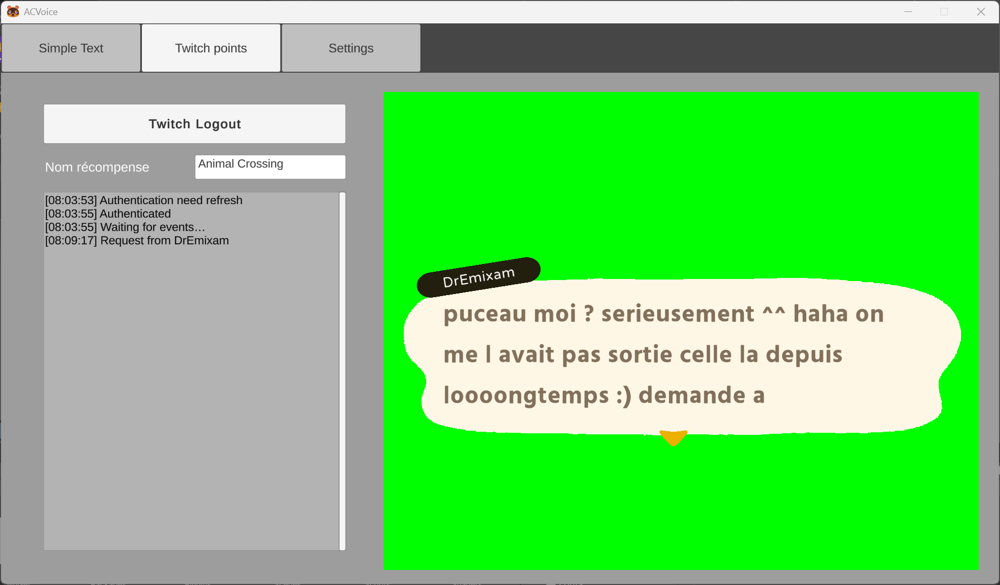
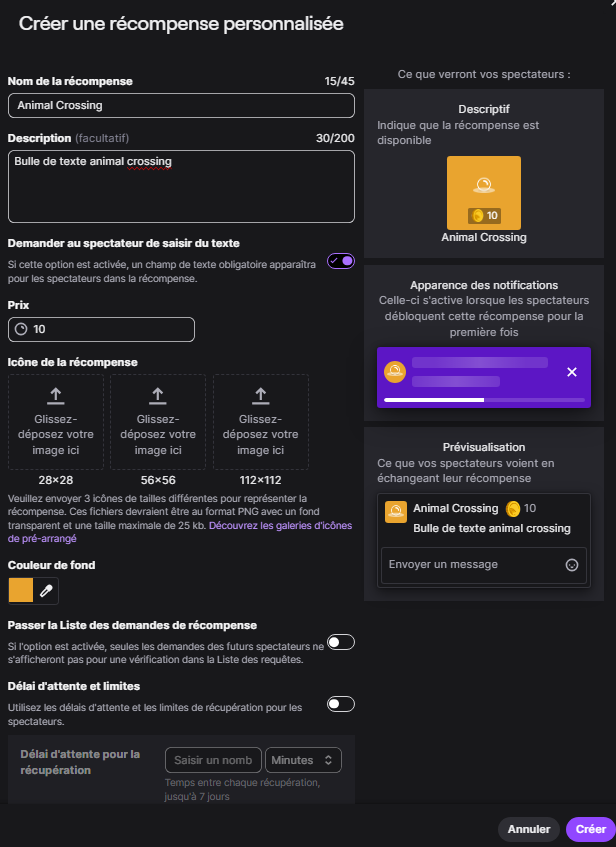
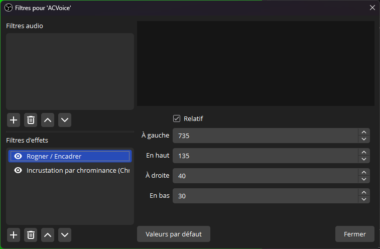
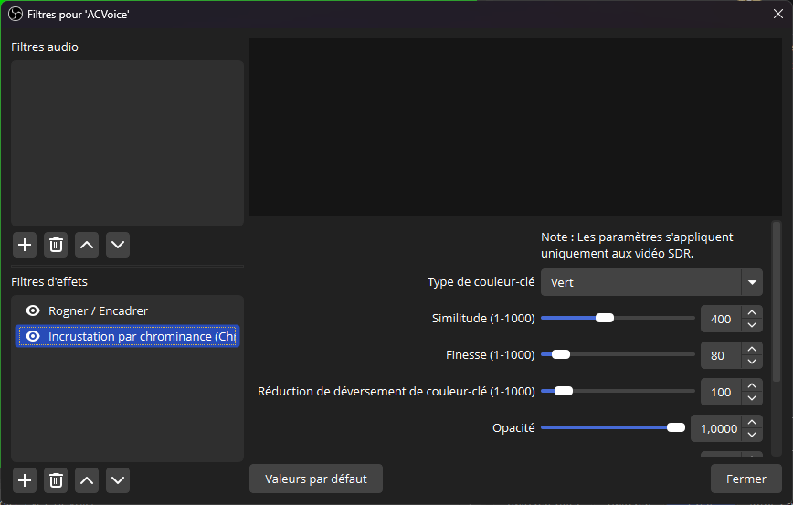

# ACVoice

ACVoice est une application Unity destinée aux streamers Twitch, permettant d'afficher à l'écran des messages dans le style des boîtes de dialogue d'Animal Crossing, avec l'effet sonore de voix caractéristique.

## Fonctionnalités principales

- **Affichage de messages façon Animal Crossing** : Lorsqu'une récompense de points de chaîne est utilisée sur Twitch, un message personnalisé apparaît à l'écran dans une boîte de dialogue animée.
- **Effet de voix Animal Crossing** : Chaque lettre du message est accompagnée d'un son, imitant la voix des personnages du jeu. Des variations de voix différentes sont utilisées pour chaque viewer.
- **Connexion à Twitch** : Authentification Twitch intégrée pour se connecter à votre compte et écouter les événements de récompenses.
- **Personnalisation** : Possibilité de configurer le nom de la récompense.
- **Interface simple**

## Installation

1. [Téléchargez la dernière version précompilée](https://github.com/dremixam/ACVoice/releases/latest/download/ACVoice-windows.zip). (Une [version macos](https://github.com/dremixam/ACVoice/releases/latest/download/ACVoice-macos.zip) est aussi disponible)
2. **Décompressez l'archive** où vous le souhaitez.
3. **Lancez l'exécutable "ACVoice.exe"**.

## Utilisation

### Création de la récompense Twitch

Dans votre tableau de bord Twitch, créez une récompense de points de chaîne personnalisée (ex : "Message Animal Crossing").
Notez bien le nom exact, il doit correspondre à celui configuré dans l'application.

### Configuration de l'application

1. **Lancer l'application**
2. **Se connecter à Twitch** via le bouton prévu à cet effet
3. **Configurer le nom de la récompense** correspondant à celle créée sur votre chaîne Twitch (ex : "ACVoice Message")
4. **Lorsqu'un spectateur utilise la récompense**, son message s'affiche automatiquement à l'écran avec l'effet sonore

### Ajout dans OBS

1. **Créer la source** de type capture de fenêtre
2. **Ajouter un filtre "rogner/recadrer"** pour ne garder que la zone verte
3. **Ajouter un filtre "chroma key"** pour rendre le fond vert transparent (les paramètres par défaut devraient convenir)
4. Enjoie

## À propos du projet

Ce projet a été développé initialement pour un usage personnel et n'est plus maintenu. Il est fourni "en l'état", sans garantie de fonctionnement ni support, et il n'est pas prévu de mises à jour futures. Le code et l'architecture sont probablement datés ou sous-optimaux sur certains aspects.

> **Note :** Si vous souhaitez modifier ou développer l'application, clonez le dépot et ouvrez le projet dans Unity 6 ou supérieur.

## Auteurs

Développé par DrEmixam
